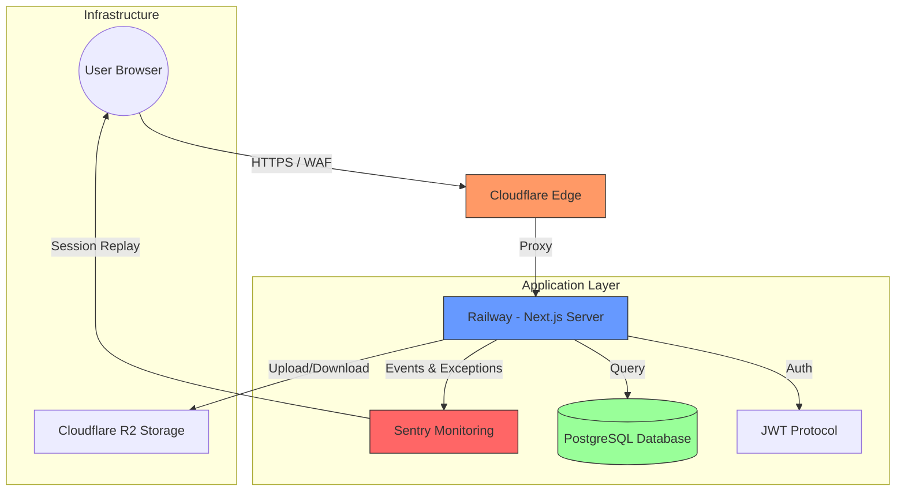

# TVGPH - GPH Report Ecosystem
## Project Overview & Technical Architecture

Este documento descreve a arquitetura, tecnologias e princípios do projeto **TVGPH (GPH Report)**, servindo como base técnica para apresentações e documentação de onboarding.

---

## 1. Visão Geral do Projeto
O **GPH Report** é uma plataforma de alta performance voltada para o rastreio de evolução, análise de relatórios e gestão de projetos de pesquisa sob protocolos de segurança rigorosos. O sistema utiliza uma estética "Industrial Brute", focada em precisão técnica, estabilidade e telemetria em tempo real.

---

## 2. Stack Tecnológica

### Core (Frontend & Backend)
- **Framework**: [Next.js 14 (App Router)](https://nextjs.org/)
- **Linguagem**: TypeScript (Strict Mode)
- **Estilização**: Tailwind CSS + Shadcn UI
- **Estado**: Zustand (Global Store)
- **Validação**: Zod (Schema Validation)

### Infraestrutura & Dados
- **ORM**: Prisma (PostgreSQL)
- **Hospedagem**: Railway (Compute & Database)
- **Edge & Security**: Cloudflare (WAF, DNS, CDN)
- **Storage**: Cloudflare R2 (Object Storage)
- **Monitoramento**: Sentry (Full-stack telemetry, Replay, Error tracking)

### Segurança & Testes
- **Auth**: JWT (JSON Web Tokens) + BcryptJS (Hashing)
- **Unit Testing**: Vitest + React Testing Library
- **E2E Testing**: Playwright

---

## 3. Diagrama de Comunicação e Eventos

O fluxo de dados do GPH é otimizado para segurança e observabilidade:

### Fluxo de Telemetria (Sentry)
1. **Breadcrumbs**: A classe `Audit` captura ações do usuário e logs de sistema.
2. **Session Replay**: Gravação visual de sessões para depuração de UX em tempo real.
3. **Issue Tracking**: Erros no servidor (Railway) ou no cliente (Browser) são agregados no Sentry.

---

## 4. Regras de Negócio e Princípios

### Regras de Negócio Core
- **Protocolo de Pesquisa Criptografado**: Todos os dados sensíveis passam por camadas de validação e auditoria antes de serem persistidos.
- **Gestão de Áreas de Pesquisa**: Usuários são segmentados por áreas específicas, com permissões granulares.
- **Ativação de Membros**: Fluxo rigoroso de convite e ativação para garantir a integridade da plataforma.

### Princípios de Engenharia
1. **Industrial Brute Aesthetic**: Design que privilegia a "verdade dos materiais" digitais - bordas nítidas, tipografia técnica e animações nativas de alta performance.
2. **Stability First**: Remoção de dependências pesadas (ex: Framer Motion) em favor de CSS nativo para evitar erros de hidratação e instabilidades em produção.
3. **Observability Driven**: Todo componente crítico deve reportar eventos via classe de Auditoria.
4. **Clean Code**: Separação clara entre lógica de negócio (`lib`), componentes de UI (`components`) e rotas (`app`).

---

## 5. Processo de Desenvolvimento

O workflow de desenvolvimento do TVGPH é focado em estabilidade contínua:

1. **Desenvolvimento Local**: Utilização de `npm run dev` com validação de tipos em tempo real.
2. **QA & Testes**: Execução de suítes de testes unitários (Vitest) antes de cada merge.
3. **Deployment**: Deploy automático via Git para a Railway.
4. **Post-Mortem & Monitoramento**: Análise de issues via Sentry para correções "hotfix" imediatas.

---

## 6. Diferenciais Técnicos
- **Zero Placeholder Policy**: Uso de imagens reais e ícones técnicos consistentes (Lucide).
- **Native Performance**: Transições de 60fps usando apenas propriedades aceleradas por hardware (transform, opacity).
- **Universal Instrumentation**: Configuração robusta de Sentry que cobre Servidor, Edge e Cliente de forma unificada.
